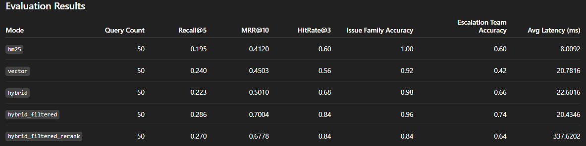

# Case Study: Learning Weaviate Practically by Building a Fintech Dispute Retriever

## Why I Built This

I started this project because I wanted to learn Weaviate practically.

Instead of reading documentation passively or building a generic “chat with your PDFs” demo, I wanted a retrieval system that felt closer to a real internal fintech tool.

So I built a **payment dispute case retriever** that helps retrieve similar historical disputes, likely issue families, and operational evidence patterns.

## The Problem

Payment disputes are not a pure semantic-search problem.

A system can retrieve text that sounds similar while still being operationally wrong because:

- the payment rail is different
- the scheme is different
- the region is different
- the reason code is different

That makes this a good problem for testing:

- BM25
- vector retrieval
- hybrid retrieval
- metadata-aware retrieval
- reranking

## What I Built

The system includes:

- a synthetic fintech dispute corpus
- local Weaviate indexing
- BM25 retrieval
- vector retrieval
- hybrid retrieval
- hybrid retrieval with metadata filters
- an experimental reranked retrieval mode
- a FastAPI retrieval API
- an evaluation harness over 50 queries

## System Design

```mermaid
graph TD
    A[Synthetic dispute dataset] --> B[Embedding pipeline]
    A --> C[Metadata fields]
    B --> D[Weaviate collection]
    C --> D
    E[FastAPI retrieval API] --> D
    E --> F[BM25]
    E --> G[Vector search]
    E --> H[Hybrid search]
    H --> I[Metadata filters]
    I --> J[Optional reranker]
    J --> K[Structured response]
    K --> L[Evaluation harness]

Retrieval Strategies Tested

I evaluated five retrieval modes:

1. bm25
2. vector
3. hybrid
4. hybrid_filtered
5. hybrid_filtered_rerank

## Evaluation Results
Mode	Query Count	Recall@5	MRR@10	HitRate@3	Issue Family Accuracy	Escalation Team Accuracy	Avg Latency (ms)
bm25	50	0.195	0.4120	0.60	1.00	0.60	8.0092
vector	50	0.240	0.4503	0.56	0.92	0.42	20.7816
hybrid	50	0.223	0.5010	0.68	0.98	0.66	22.6016
hybrid_filtered	50	0.286	0.7004	0.84	0.96	0.74	20.4346
hybrid_filtered_rerank	50	0.270	0.6778	0.84	0.84	0.64	337.6202

##Key Result

The best-performing setup was hybrid retrieval with metadata filters.

That was the most important lesson in the project.

The more complex reranked setup did not improve the system. It reduced several quality metrics and increased latency significantly.

What Surprised Me

I expected reranking to improve retrieval quality.

It didn’t.

That matters because it is easy to assume that adding another model automatically makes a retrieval system better. In this case, evaluation showed the opposite.

This was the biggest practical lesson from the project:

Retrieval systems should be judged by measured performance, not by architectural intuition alone.

## What I Learned About Weaviate

Working with Weaviate practically helped me understand:

- where vector search helps
- where keyword search still matters
- why hybrid retrieval is often stronger than either one alone
- why metadata filtering is critical in structured business domains
- why evaluation matters more than adding complexity

## What I Would Improve Next

If I extended this project, I would work on:

- failure analysis on the reranker regressions
- better domain-specific reranking text construction
- per-query error analysis
- visualization of retrieval failures
- route-level observability
- duplicate dispute detection and escalation routing

###Repository Artifacts

## Relevant outputs:

- artifacts/metrics/summary.csv
- artifacts/metrics/summary.json
- artifacts/metrics/query_rows.csv

## Final Takeaway

I built this project to learn Weaviate practically.

The final lesson was bigger than Weaviate itself:

## The winning retrieval system was the one with the best measured design, not the most complicated stack.